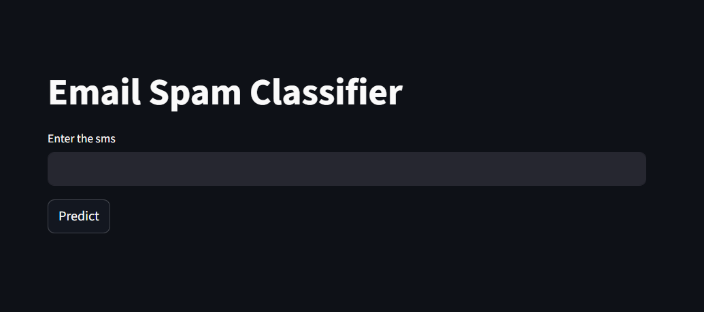
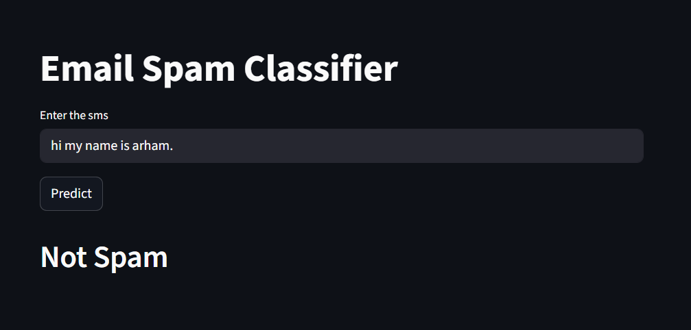
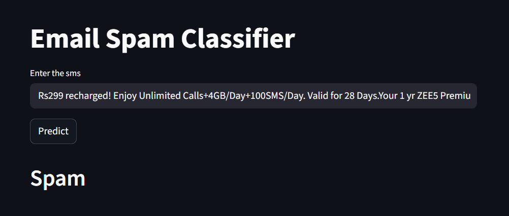

# 📩 SMS Spam Detection System

> An NLP-powered machine learning project that detects whether an SMS message is **Spam** or **Ham (Not Spam)** using advanced text preprocessing and classification models.


---

## 🚀 Features

- 📩 Detects spam and legitimate SMS messages
- 🧹 Advanced NLP text preprocessing pipeline
- 🔤 Tokenization, stopword removal, and stemming
- 📊 Exploratory Data Analysis with visualizations
- 🧠 Multiple ML models trained and compared
- ⚡ TF-IDF based feature extraction
- 🎯 High accuracy spam classification
- 💾 Exportable trained model and vectorizer using Pickle

---
## 📸 Screenshots

<table>
  <tr>
    <td><strong>Main Interface</strong><br/></td>
    <td><strong>Prediction Result Ham</strong><br/></td>
    <td><strong>Prediction Result Spam</strong><br/></td>
  </tr>
</table>

## 🧠 How It Works

```text
User inputs SMS text
        ↓
Text preprocessing pipeline
        ↓
TF-IDF vectorization
        ↓
Machine Learning model prediction
        ↓
Outputs Spam or Ham classification
```

### Model Details
- Algorithm: Random Forest Classifier
- Type: Supervised Binary Classification
- NLP Technique: TF-IDF Vectorization
- Dataset: Combined SMS Spam datasets

---

## 📊 Exploratory Data Analysis

The notebook includes:

- Spam vs Ham distribution analysis
- Character count analysis
- Word count analysis
- Sentence count analysis
- Correlation heatmaps
- Word clouds for spam and ham messages
- Most frequent spam keywords

---

## 🧹 Text Preprocessing Pipeline

The preprocessing workflow includes:

- Converting text to lowercase
- Tokenization
- Removing special characters
- Removing stopwords
- Removing punctuation
- Applying stemming using PorterStemmer

Example:

```python
def text_pp(text):
    text = text.lower()
    text = nltk.word_tokenize(text)

    y = []
    for i in text:
        if i.isalnum():
            y.append(i)

    text = y[:]
    y.clear()

    for i in text:
        if i not in stopwords.words('english') and i not in string.punctuation:
            y.append(i)

    text = y[:]
    y.clear()

    for i in text:
        y.append(ps.stem(i))

    return " ".join(y)
```

---

## 🤖 Machine Learning Models Used

The following models were trained and evaluated:

| Model | Purpose |
|---|---|
| Gaussian Naive Bayes | Baseline probabilistic model |
| Multinomial Naive Bayes | NLP text classification |
| Bernoulli Naive Bayes | Binary feature classification |
| Random Forest Classifier | Final selected model |
| Extra Trees Classifier | Ensemble learning |
| AdaBoost Classifier | Boosting model |
| Voting Classifier | Ensemble voting |
| Stacking Classifier | Meta ensemble learning |

---

## 🏆 Final Model

The final selected model:

- ✅ Random Forest Classifier
- ✅ TF-IDF Vectorization (`max_features=2000`)
- ✅ Saved using Pickle serialization

Generated files:

```text
model.pkl
Vectorizer.pkl
```

---

## 🛠️ Tech Stack

| Layer | Technology |
|---|---|
| Language | Python |
| ML Framework | Scikit-learn |
| NLP | NLTK |
| Data Handling | Pandas, NumPy |
| Visualization | Matplotlib, Seaborn |
| Word Clouds | WordCloud |
| Model Serialization | Pickle |

---

## 📂 Project Structure

```text
sms-spam-detection/
├── model.ipynb            # Main Jupyter notebook
├── model.pkl              # Trained ML model
├── Vectorizer.pkl         # TF-IDF vectorizer
├── spam_ham_india.csv     # Dataset
├── cleaned_sms_spam.csv   # Dataset
├── requirements.txt       # Dependencies
└── README.md
```

---

## ⚡ Run Locally

```bash
git clone https://github.com/your-username/sms-spam-detection.git
cd sms-spam-detection
pip install -r requirements.txt
jupyter notebook
```

Open:

```text
model.ipynb
```

---

## 📈 Workflow

```text
Load Dataset
     ↓
Clean and Merge Data
     ↓
Perform EDA
     ↓
Preprocess Text
     ↓
Convert Text to Numerical Features
     ↓
Train Multiple Models
     ↓
Evaluate Performance
     ↓
Select Best Model
     ↓
Save Model and Vectorizer
```

---

## 🔮 Future Improvements

- Add deep learning models (LSTM/BERT)
- Build a Streamlit or Flask web app
- Add real-time SMS prediction interface
- Improve dataset diversity
- Hyperparameter optimization

---

## 👨‍💻 Author

**Mohammad Arham Nawed**  
B.Tech ECE (Embedded Systems & IoT)

[](https://github.com/your-username)
